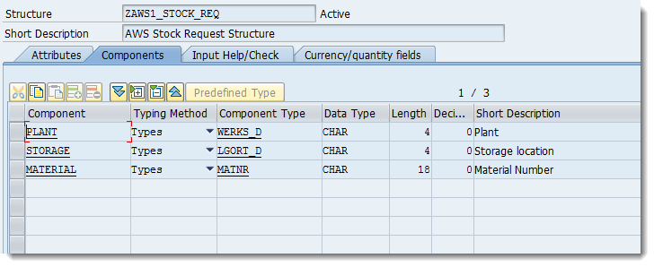
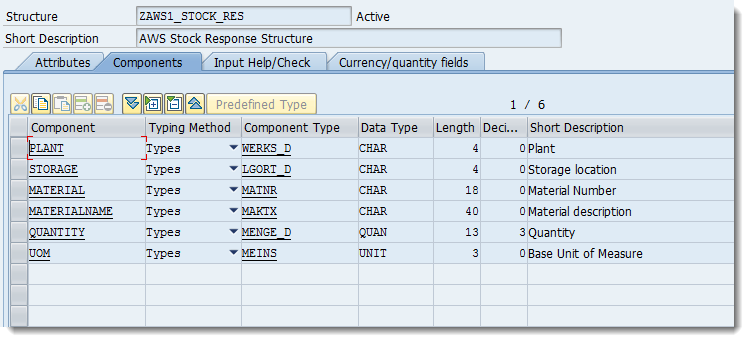
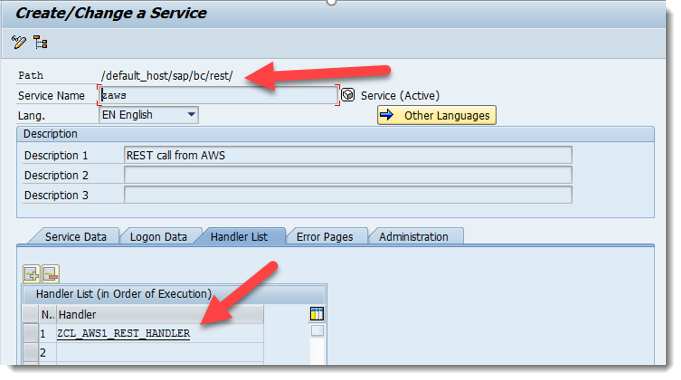
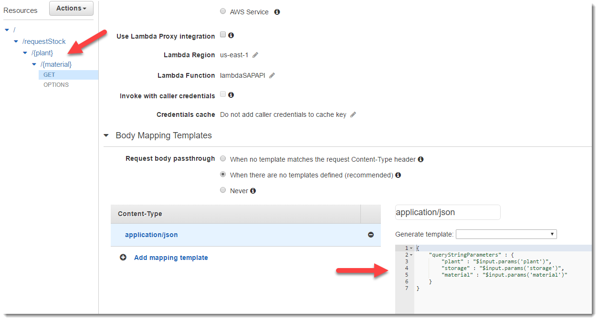
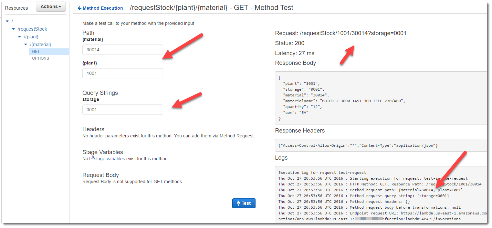
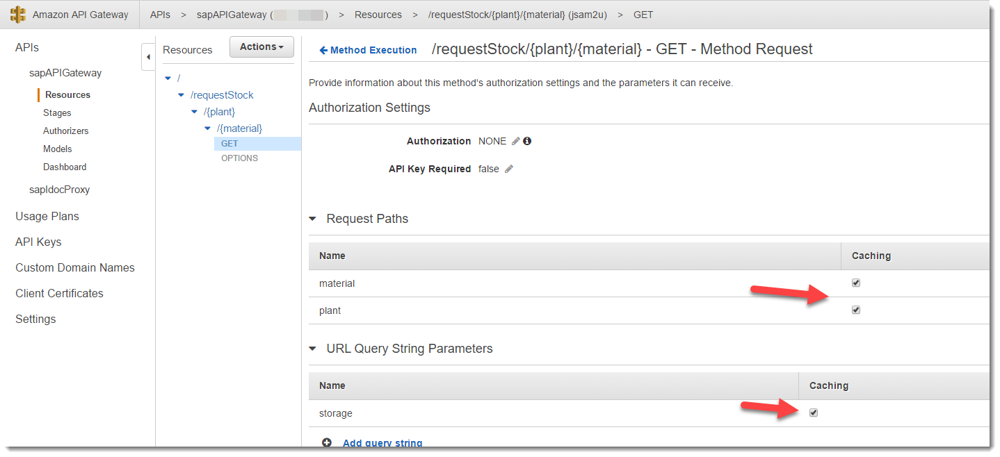
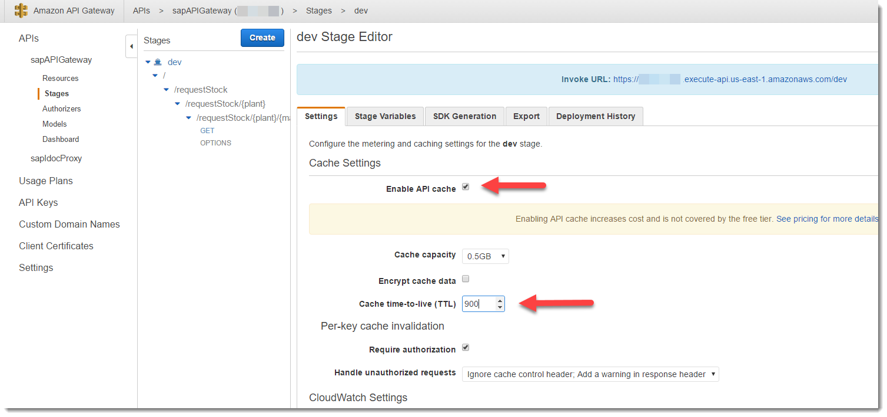

# Calling into SAP Netweaver from AWS Lambda

One of the challenges of acheiving the coveted "real-time inventory visibility" for public-facing applications is that it is nearly impossible to acheive.  Let's say that SAP ECC was your source of record for inventory and you indeed used all the local business processes to get that perpetual invnetory view.  You use sales orders, material movements, warehouse management features...Great!

The problem comes when you want to expose that real-time visibility to public-facing applications like a mobile app or web site.  Most implementations get around this by replicating a copy of inventory into a special "offline" copy that gets updated every so often.  This way, your public apps are hitting this shadow copy of inventory.

Well, this really isn't "real-time inventory" as your shadow copy is most likely out of phase with your SAP ECC copy.  If you take orders online, you still have a chance that inventory could be sold or transfered out from under that sales order leading to customer disappointment.

I wanted to create a mashup between AWS API Gateway and SAP ECC to achive a caching inventory lookup service that might be able to front-end to public apps.

## Objectives
- Has to be serverless (except for the SAP server)
- Has to scale, be highly available
- Able to cache responses to reduce calls to the back-end ERP system

## The Design

Using AWS API Gateway and Lamdba, we can build a service that reaches back into SAP ECC real-time to fetch the inventory.  Like a good lean warehouse, our warehouse processes are on a regular schedule--they don't randomly do activities.  Rather, they have waves of activities.  Receipts are done during a certain time.  Allocation runs are done on a fixed schedule.  Inventory is picked, packed and shipped on a given schedule.  Given how all these processes are interlaced, we know that inventory only significantly changes in certain intervals--lets say 30 minutes.  (In reality, many enterprises have disparate systems that impact inventory and have batch processes that try to reconcile periodically.)

So, that means that we don't really have to call back to the SAP ECC system for every single query if we get the same query within a 30 minute period of time...we can cache the response.   AWS API Gateway allows us to do exactly that via its caching functionality!  We improve the response time to the calling application and reduce load on our ERP system too!

This is not meant to be production ready as-is.  We're not implementing any security, no encryption and no graceful failure if the SAP ECC endpoint is offline.  Before you try to implement this in a production environment, please consider these other things as well.  This document is just meant to be a study in the specific interaction and integration between SAP Netweaver and AWS Services and hopefully inspires someone to riff on this idea too.

## The Steps
1. Create some structures for the REST service
2. Create REST endpoint on SAP ECC to receive the call
3. Create the backing ABAP code behind the SAP ECC REST endpoint
4. Configure the REST endpoint in SICF
5. Create Lambda routine to call the SAP ECC service
6. Create API Gateway as the front endpoint
7. Implement Caching on the API Gateway

## 1. Create some structures for the REST services
We need to create a couple strutures...one for the request and one for the response.




## 2. Create REST Endpoint on SAP ECC
For our REST service on SAP ECC, we are going to create a few structures.

Next, we need to create a custom HTTP handler ```ZCL_AWS1_REST_HANDLER``` by creating a new class which inherits from ```CL_REST_HTTP_HANDLER```.  There is a quite detailed tutorial for doing this over at the [SAP Community Blog](https://blogs.sap.com/2013/01/24/developing-a-rest-api-in-abap/) so I'm just going to hit the highlights here.
```abap
method IF_REST_APPLICATION~GET_ROOT_HANDLER.
  DATA lo_handler TYPE REF TO cl_rest_router.
  CREATE OBJECT lo_handler.
  lo_handler->attach( iv_template = '/stock'  iv_handler_class = 'ZCL_AWS1_RES_STOCK' ).
  ro_root_handler = lo_handler.
endmethod.
```
## 3. Create the backing ABAP code behind the SAP ECC REST endpoint
We need to create a ```GET``` and ```POST``` method for our new ```/stock``` endpoint.  We redefine the ```IF_REST_RESOURCE~GET``` method to fetch the CSRF token.

```abap
METHOD if_rest_resource~get.
  DATA: lo_entity       TYPE REF TO if_rest_entity,
        lv_current_time TYPE timestamp.
  GET TIME STAMP FIELD lv_current_time.
  mo_response->set_header_field( iv_name = 'Cache-Control' iv_value =  'no-cache, no-store, must-revalidate' ). "#EC NOTEXT
  mo_response->set_header_field(
    iv_name = 'ABAP-Execution-Time'                         "#EC NOTEXT
    iv_value = cl_rest_http_utils=>format_http_date( iv_timestamp = lv_current_time ) ).
  mo_response->set_status( cl_rest_status_code=>gc_success_ok ).
ENDMETHOD.
```
We also redefine the ```POST``` method to call the code which actually gets the inventory.  Notice we're collecting the query string params and passing them on to the method that does the actual inventory query.
```abap
METHOD if_rest_resource~post.

  DATA:   lv_json_i     TYPE string,
          lv_json_o     TYPE string,
          lv_current_time TYPE timestamp,
          lv_guid TYPE zcp_guid,
          lo_entity   TYPE REF TO if_rest_entity.

  DATA: ls_params TYPE zaws1_stock_req,
        lt_result TYPE zaws1_stock_res_t.

  GET TIME STAMP FIELD lv_current_time.

  lv_json_i = io_entity->get_string_data( ).

  zcl_aws1_json_util=>json_to_data( EXPORTING iv_json = lv_json_i
                                           IMPORTING es_data = ls_params ).

  lt_result = _get_stock( ls_params ).

  lv_json_o = zcl_aws1_json_util=>data_to_json( lt_result ).

** Response

  mo_response->set_header_field( iv_name = 'Cache-Control' iv_value =  'no-cache, no-store, must-revalidate' ). "#EC NOTEXT
  mo_response->set_header_field(
    iv_name = 'ABAP-Execution-Time'                         "#EC NOTEXT
    iv_value = cl_rest_http_utils=>format_http_date( iv_timestamp = lv_current_time ) ).

  lo_entity = me->mo_response->create_entity( ).

  lo_entity->set_modification_date( iv_modification_date = lv_current_time ).
  lo_entity->set_content_type( iv_media_type = if_rest_media_type=>gc_appl_json ).
  lo_entity->set_content_language( sy-langu ).
  lo_entity->set_string_data( lv_json_o ).
  mo_response->set_status( cl_rest_status_code=>gc_success_ok ).

  COMMIT WORK.

ENDMETHOD.
```

Finally, we come to the code that gets the stock based on the query string params in the POST.  ```METHOD _get_stock``` is in this repo.

## 4. Configure the REST endpoint in SICF
We next need to create the endpoint in ```tcode:SICF``` and assign our new handler class to the endpoint.



## 5. Create Lambda Routine to bridge API Gateway to SAP ECC
The Lambda routine is just a simple call out to the REST services.  The specific code is located [in this repository] (./tree/master/src/lambda).  There is a bit of a trick in needing to fetch a CSRF token.  You can see this in the ```sapapi.js``` file.

```javascript
...
var headers = {
			'Authorization': sAuth,
			'x-csrf-token': "fetch"
		};

		var options = {
			host: extsys.host,
			port: extsys.port,
			path: endpoint,
			method: "GET",
			headers: headers
		};

		var req = http.request(options, function (res) {
			resolve(res);
		});
...
```
Then in the POST header:
```javascript
...
headers['X-CSRF-Token'] = oGetRes.headers['x-csrf-token'];
...
```

## 6. Create API Gateway as the Front Endpoint
We can now create the API Gateway that will catch the external calls and route them to the Lambda routine.  Notice that here I'm using a combination of URL Paths and Query String parameters.  No real reason other than just to show you can mix and match.  They are all just parameters in the ```$input.params``` variable from the API Gateway.



Here you can see that we test out the call and we're able to get back an inventory number.



## 7. Implement Caching on the API Gateway
Now for the easy part--caching.  It literally is checking a few boxes.  First, we tell API Gateway to use all our parameters as cache keys:



Next we enable caching in the stage deployment:



In this case, I set Time-To-Live (TTL) as 15 minutes.  With our original scenario assumption that inventory doesn't change any more frequent than a 30 minute "takt time", 15 minutes lets us be no more out of phase than 15 minutues.   The maximum TTL for API Gatway is 60 minutes.

As an optimization, you could set the max TTL as 60 minutes and then trigger a cache flush on a given cache key when an event occurs.  Lets say that 80% of your products are slow-moving from an inventory standpoint, while 15% turnover moderately fast and 5% turnover very fast.   One TTL duration doesn't fit all turnover velocities.   Using standard SAP functionality of output determination to trigger an outbound IDOC and using what we detail in our article ["Integrating SAP's IDOC Interface into AWS API Gateway and AWS Lambda"](https://github.com/ApplexusLabs/aws-sap-idoc-tricks), you could write a Lambda routine that catches that goods movement IDOC and flushes the cache of the API Gateway for that specific cache key.

That would get you as close as you possibly could be to being able to serve up real-time inventory and leverage API Gatway caching to minimize the load on your backend SAP ECC system.